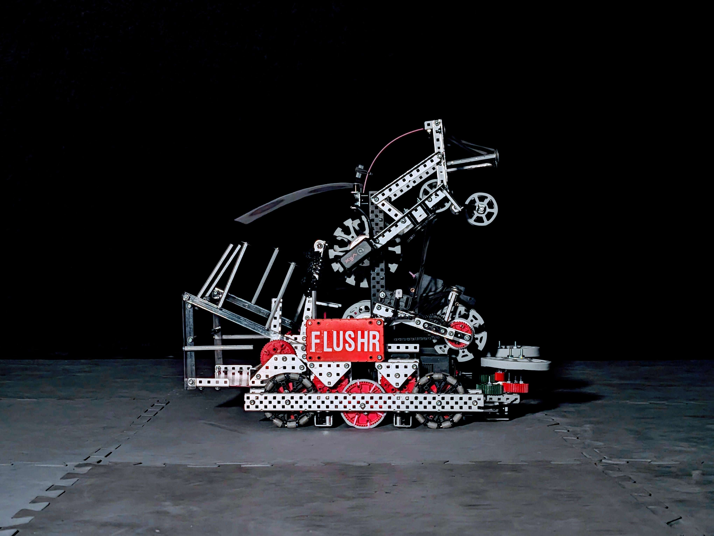

# flusher
  
Flusher is a simple pre-season robot that can play all aspects of the VEX Push-Back game.  
   

- 66w 400rpm 3.25" drive  
- 2x 5.5w side rollers  
- 2x 5.5w conveyor rollers  

## Controls
- `L2` Intake 
- `L1` Outtake 
- `R2` Score 
- `Y` score slowly
- `A` Enable / Disable auto poop
- Tank Drive (by default)
  
Flusher uses a shift key, where the functions of each button change slightly while holding the shift key, similar to how a keyboard changes to CAPITOL LETTERS.
- `R1` Shift
- `L2` + `R1` Intake ONLY the side rollers
- `L1` + `R1` Outtake ONLY the side rollers
- `R2` + `R1` Poop

## Useful File Descriptions
This code was structured so the way you move subsystems in opcontrol is identical to autonomous.  Each subsystem has a task that "listens" for what the current roller state is, and they will each figure out on their own what to do.  
 - `src/roller_config.cpp`: Sets the active roller state.  
 - `src/main.cpp` Main file with on screen autonomous selection, this is basically the EZ-Template example project.  But in `opcontrol` there is user control code added.  
 - `src/anitjam.cpp`: "Motor" object that gives the option to let each motor actively try to unjam itself.  
 - `src/color_detection.cpp`: Decides when a blue or a red ball is in the robot.  
 - `src/conveyor.cpp`: Conveyor functions for opcontrol and autonomous.  
 - `src/side_rollers.cpp`: Side roller functions for opcontrol and autonomous.  
 - `src/auton.cpp`: Default EZ-Template example autonomous routines.  

## EZ-Template
This code uses EZ-Template, a simple PROS template that handles drive base functions for VEX robots. [That can be found here](https://ez-robotics.github.io/EZ-Template/).  

## External Links
[Reveal Video](https://youtu.be/0-yhN4ntpAA)  
[Episode 1 Documentary](https://youtu.be/FOxbkzGKC6Q)  
VEXForum Link: coming soon...
Episode 2 Documentary: coming soon...

## Contributors
Thank you to the following for making this project come to life:  
- Evan Chung
- Gil Porter
- Goobins Family
- Ilkay Kabirinia
- Jess Zarchi
- Liam Cahill
- Oz Goobins
- SPUR-FLYS
